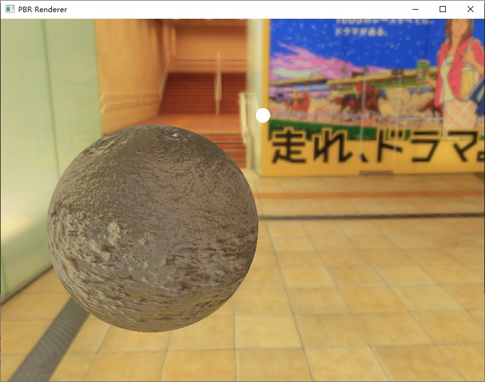

# PBR Render

This is a demo of [physically based rendering](https://en.wikipedia.org/wiki/Physically_based_rendering) written in C++ and OpenGL. A lot of the source codes are adapted from the popular OpenGL tutorial website [learnopengl.com](https://learnopengl.com/). A graphics card that supports OpenGL 3.3+ is required to run this demo, so be sure to update your graphics driver if you run into any issue.

## Libraries and resources used

[GLFW](https://www.glfw.org/): Context creation and input handling library

[Glad](https://glad.dav1d.de/): OpenGL function loader

[GLM](https://glm.g-truc.net/): OpenGL Mathematics library

[Assimp](https://assimp.org/): Open asset import library

[stb_image](https://github.com/nothings/stb/blob/master/stb_image.h): single header image loader

PBR material texture from [freepbr.com](freepbr.com)

HDR environment texture from [hdrlabs](http://www.hdrlabs.com/sibl/archive/)

## Interaction Guide

W/A/S/D and mouse:  navigate through the scene as you would in a FPS game

Mouse wheel: zoom in/out

Q/E: rotate object of interest

N: toggle normal shader

L: toggle wireframe/fill

## TODO

- height map support (geometry shader)
- load models created in 3D software
- utilities to add one or more point lights in the scene
- text rendering

